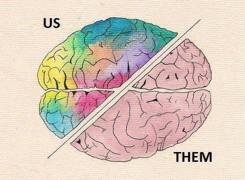

# ACIDBrain

    </img>

A software application that applies Microservices architecture

## TODOs

- Nimo:
    - Look at how to add plugin to Kong
    - Go through https://getkong.org/docs/0.10.x/plugin-development/distribution/
    - Learn Kong, Docker, Spring framework
- Nana:
    - Implement finance API in spring
    - Go through http://eventuate.io/exampleapps.html
    - Learn Eventuate, Spring, AWS

## Tutorials

- Tutorial: KONG API Gateway v1.0 https://www.jianshu.com/p/5400bf1aceda
- Adding docker to AWS: https://docs.aws.amazon.com/AmazonECS/latest/developerguide/docker-basics.html
- Adding an API to Kong: https://getkong.org/docs/0.5.x/getting-started/adding-your-api/
- Spring project example repo: https://github.com/cloudframeworks-apigateway/springdata
- Eventuate example: http://eventuate.io/exampleapps.html

## Resources

- Final report:  https://docs.google.com/document/d/1X2q3e8XPLXCRlidIB-_euXKNGGPre2OrInVEXsDklD4/edit?usp=sharing

- Eventuate demo:
https://docs.google.com/document/d/16F6Zm_NIGKJGE1j2DMkEcWIHdgmALUyt0eaz4A89hhc/edit?usp=sharing

- Eventuate test urls
    - http://18.218.84.183:8081/swagger-ui.html create customer; get customer
    - http://18.218.84.183:8082/swagger-ui.html view customer history order; get order
    - http://18.218.84.183:8083/swagger-ui.html create order;
    - http://18.218.84.183:8084/swagger-ui.html create shipment
- Eventuate curl sample
    - see eventuate/test-eventuate.txt
- Axon test urls
    - http://18.218.84.183:8091/swagger-ui.html create order
    - http://18.218.84.183:8092/swagger-ui.html get order info, shipment info
- Axon curl sample
    - successful scenario

    - curl -X POST -H "Content-Type: application/json" -d '{"productId":"testProduct", "comment":"testComment", "price":"20"}' http://18.218.84.183:8091/api/order
    
    - failed shipment scenario

    -curl -X POST -H "Content-Type: application/json" -d '{"productId":"failShipment", "comment":"testComment", "price":"20"}' http://18.218.84.183:8091/api/order

- Eventuate slide:
https://www.slideshare.net/chris.e.richardson/a-pattern-language-for-microservices-gluecon-2016
- Presentation: https://docs.google.com/presentation/d/1UEZdzA1ftTM6Hj4YYuEuLEDKDaULurmaftdiqi5Ea2k/edit?usp=sharing
