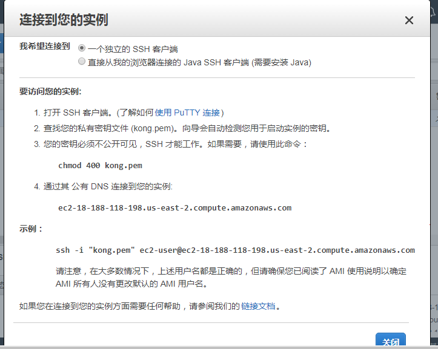

# ACIDBrain

    </img>

A software application that applies Microservices architecture

## TODOs

- Nimo:
    - Look at how to add plugin to Kong
    - Go through https://getkong.org/docs/0.10.x/plugin-development/distribution/
    - Learn Kong, Docker, Spring framework

## AWS

- AWS information: 

## Tutorials

- Tutorial: [云框架]KONG API Gateway v1.0 https://www.jianshu.com/p/5400bf1aceda
- Adding docker to AWS: https://docs.aws.amazon.com/AmazonECS/latest/developerguide/docker-basics.html
- Adding an API to Kong: https://getkong.org/docs/0.5.x/getting-started/adding-your-api/
- Spring project example repo: https://github.com/cloudframeworks-apigateway/springdata
